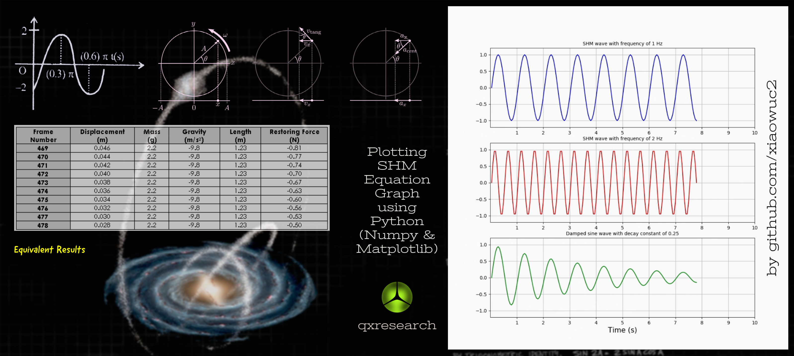

    
  </a>
  <h3 align="center">Simple Harmonic Motion</h3>
  

    Plotting SHM Graph using Python (Matplotlib | Numpy)
       
     
  

### Abstract
Programming is influencing all disciplines and helping scientists discover in the field of Science and Mathematics with the help of technology. The concept of Simple Harmonic Motion is used to create graphs of waves using Python (Numpy | Matplotlib | Scipy) where the user can make changes to the amplitude, initial phase, and frequency of the wave. Users can also add a decay or damping constant. Users can also plot any SHM graphs using this program. As a demonstration, a spring simulation has been given in .py format.

 
 

### What is SHM? 
In mechanics and physics, simple harmonic motion is a special type of periodic motion where the restoring force on the moving object is directly proportional to the object's displacement magnitude and acts towards the object's equilibrium position.

### Math behind SHM
- SHM can be modeled as a sine or cosine wave moving forward with time t
- Equation of SHM is: y = A sin(𝝎t + 𝜽), we plot time t on the X axis and the corresponding position on the Y axis
A = amplitude, 𝝎 = angular frequency, 𝜽 = initial phase

    
  </a>

  

    Fig. Simple Harmonic Motion
  

### Algorithm
- Set the size of each step and the number of total steps
- Define a function (`data_gen`) that will compute the value of the wave at each point in time t from 0 seconds in steps of 0.5s for 1000 times
- Create a set of arrays to store these values as required for plotting, one for the X axis and different arrays for values of the Y axis 

### How the program works? 
- Program `SHM-1.py` will plot three diffrent graphs 2 - with multiple frequency values and 1 - that is damped.
- Program `SHM-2.py` will plot a spring simulation.

### Running the Programs
- Download the code and run (double click) the `.py` files to plot the graphs
- `SHM-1.py` will plot three different SHM waves: a simple sine wave, a sine wave with twice the frequency, and a damped sine wave
- `SHM-2.py` will simulate the motion of an ideal spring and plot its position, velocity, and acceleration over time

### Detailed Explanation of the Code

#### SHM-1.py
- **Imports**: The script imports necessary libraries such as `numpy` for numerical operations, `matplotlib.pyplot` for plotting, and `matplotlib.animation` for creating animations.
- **Variables**: Important variables like `step`, `numstep`, and `amp` are defined to control the simulation.
- **Data Generation**: The `data_gen` function generates the y-values for the SHM waves at each time step.
- **Plot Setup**: A figure with three subplots is created to display the different SHM waves.
- **Animation**: The `calculate` function updates the data for each frame of the animation, and `FuncAnimation` is used to create the animation.

#### SHM-2.py
- **Imports**: Similar to `SHM-1.py`, this script imports necessary libraries.
- **Spring Data**: Constants like spring constant `k`, mass `m`, angular frequency `w`, phase `phi`, and amplitude `A` are defined.
- **Functions**: Functions to calculate position, velocity, and acceleration of the spring are defined.
- **Plot Setup**: A figure with three subplots is created to display the position, velocity, and acceleration of the spring.
- **Animation**: The `animate` function updates the data for each frame of the animation, and `FuncAnimation` is used to create the animation.

